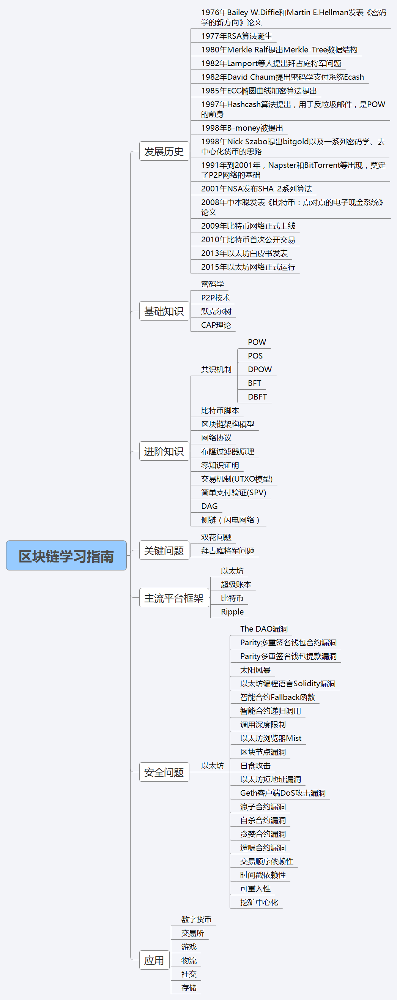
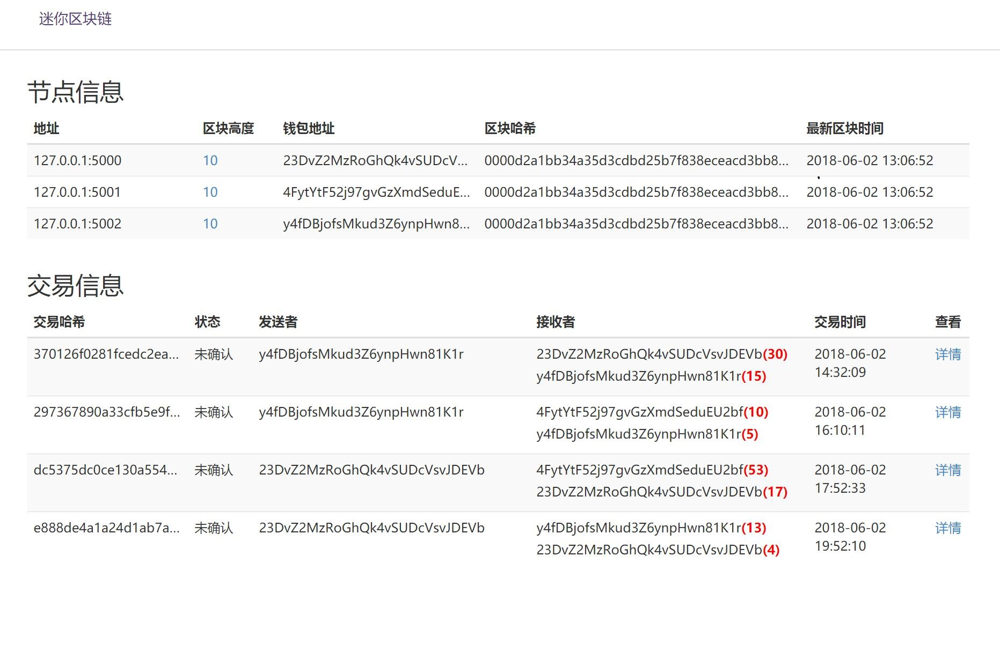

# 区块链知识体系总结

## 一、区块链知识体系脑图

## 二、区块链理论知识学习

* [区块链快速入门](https://shuwoom.com/?p=403)
* [比特币交易原理分析](https://shuwoom.com/?p=430)
* [区块链密码学基础](https://shuwoom.com/?p=643)
* [数字证书是什么](https://shuwoom.com/?p=672)
* [Merkle树和SPV机制](https://shuwoom.com/?p=692)
* [P2P技术是什么](https://shuwoom.com/?p=721)
* [Kademlia算法学习](https://shuwoom.com/?p=813)
* [区块链共识机制入门 ](https://shuwoom.com/?p=798)
* [深入浅出Raft共识算法](https://shuwoom.com/?p=826)
* [布隆过滤器(BLOOM FILTER)、SPV和比特币](https://shuwoom.com/?p=857)
* [区块链网络设计](https://shuwoom.com/?p=449)

## 三、动手实践

从零开发一个mini区块链：[http://miniblockchain.shuwoom.com](http://miniblockchain.shuwoom.com)。
后续写相应的教程，理论结合实践，加深对区块链技术的理解。

## 四、Token（数字货币）分析
Todo，敬请期待…

关注我的微信公众号（shuwoom的博客），每周定期推送干货：

